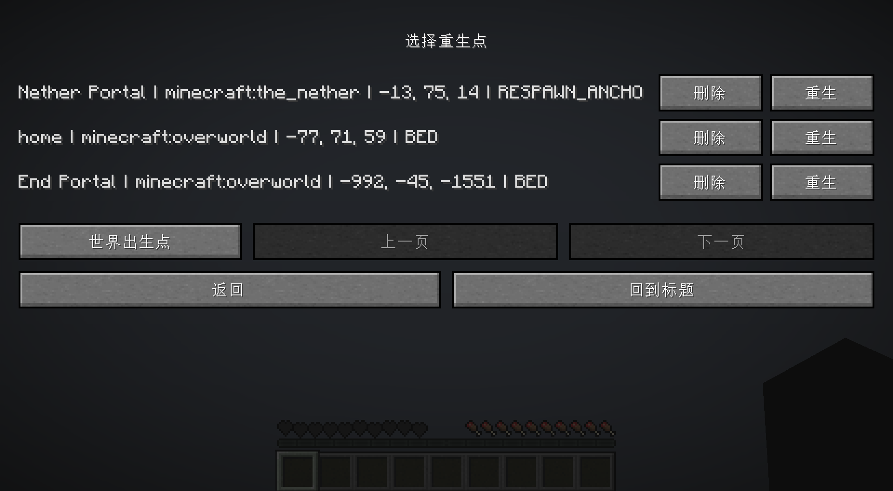
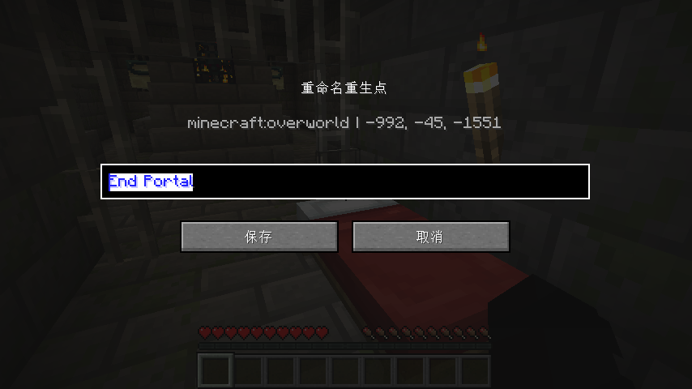

# Multi Respawn Selector

简体中文 | [English](README.md)

Multi Respawn Selector 是一个适用于 Minecraft Java 版 1.20.1 的 Fabric 模组。它让每位玩家可以保存多个重生点，而不是只能使用最后一次设置的床或重生锚。

玩家死亡后，点击原版“重生”按钮会打开重生点选择界面。你可以从仍然有效的床、重生锚、命令添加的重生点，或世界出生点中选择一个位置复活。



## 功能

- 为每位玩家独立保存多个重生点。
- 支持床、重生锚和命令添加的自定义重生点。
- 死亡后显示重生点选择界面。
- 所有重生点选择都由服务端验证。
- 床或重生锚被破坏、丢失、阻挡、没电或附近不安全时，会自动清理或拒绝使用。
- 支持跨维度重生。
- 使用重生锚复活时只消耗 1 点充能。
- 支持给已保存的床和重生锚重命名。
- 重生点数据会随世界存档持久化，服务器重启后仍然保留。
- 内置英文和简体中文本地化。

## 需求

- Minecraft Java 版 1.20.1
- Fabric Loader
- Fabric API
- Java 17 或更高版本

客户端和服务端都需要安装本模组。

## 使用方式

正常设置重生点：

- 睡床后，该床会被保存为重生点。
- 使用已充能的重生锚后，该重生锚会被保存为重生点。
- 使用 `/multirespawn add <名称>` 可以把当前位置保存为命令重生点。

死亡后：

1. 点击原版“重生”按钮。
2. 在选择界面中选择一个已保存的重生点。
3. 服务端会验证该重生点是否仍然有效。
4. 如果有效，玩家会在该位置复活。
5. 如果无效，该重生点会被移除或拒绝，并刷新列表。

如果没有可用的已保存重生点，可以选择世界出生点。

## 重命名重生点

对自己已经保存过的床或重生锚潜行 + 右键，可以打开重命名界面。



也可以使用指令重命名：

```text
/multirespawn rename <id或名称> <新名称>
```

如果旧名称包含空格，请使用引号：

```text
/multirespawn rename "主基地床" "村庄备用床"
```

## 指令

```text
/multirespawn add <名称>
```

将当前位置添加为命令重生点。

```text
/multirespawn list
```

列出你的已保存重生点。显示前会刷新并清理失效的床和重生锚。

```text
/multirespawn remove <id或名称>
```

删除一个已保存的重生点。

```text
/multirespawn rename <id或名称> <新名称>
```

重命名一个已保存的重生点。

```text
/multirespawn clear
```

清空你的所有已保存重生点。

## 有效重生点规则

已保存的重生点必须仍然安全且可用。

床会在以下情况下失效：

- 床方块被破坏。
- 保存的位置不再是床。
- 附近找不到安全落点。

重生锚会在以下情况下失效：

- 重生锚被破坏。
- 保存的位置不再是重生锚。
- 重生锚没有充能。
- 附近找不到安全落点。

命令和自定义重生点会在以下情况下失效：

- 所在维度不存在。
- 附近找不到安全落点。

## 本地化

模组内置：

- 英文：`en_us`
- 简体中文：`zh_cn`

显示语言会跟随玩家的 Minecraft 语言设置。

## 从源码构建

```powershell
.\gradlew.bat build
```

构建后的模组 jar 位于：

```text
build/libs/
```
